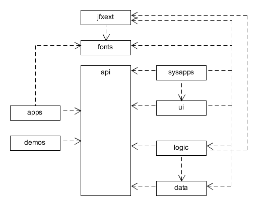

# JFXDE
## About
JFXDE is a high level desktop environment in JavaFX. The apps are registered as services using Java modules.

See a demo video:

[](https://www.youtube.com/watch?v=unqYNbjHKsY)

## Architecture
### Modules



## Dependencies
It depends on the following libraries and their dependencies:

- [OpenJDK 12](http://jdk.java.net)
- [OpenJFX 13](https://openjfx.io)
- [Hibernate ORM](https://hibernate.org/orm/)
- [H2 DB](https://www.h2database.com)
- [RichTextFX](https://github.com/FXMisc/RichTextFX)
- [ControlsFX](https://github.com/controlsfx/controlsfx)
- [Java Parser](https://javaparser.org)
- [Picocli](https://picocli.info)
- [GSON](https://github.com/google/gson)

## App Example
This is a simple example of a hello world app. It implements the App interface and declares the required permissions.

```java
package dev.jfxde.demos.hello;

import java.util.PropertyPermission;

import dev.jfxde.api.App;
import dev.jfxde.api.AppContext;
import dev.jfxde.api.AppManifest;
import dev.jfxde.api.PermissionEntry;
import javafx.scene.Node;
import javafx.scene.control.Label;

@AppManifest(fqn = "dev.jfxde.hello", name = "hello", version = "1.0.0", vendor = "JFXDE", website = "http://www.duckduckgo.org?q=hello")
@PermissionEntry(type = PropertyPermission.class, target = "user.name", actions = "read")
public class HelloApp implements App {

	@Override
	public Node start(AppContext context) {
		String username = System.getProperty("user.name");

		return new Label("Hello " + username + "!");
	}
}
```

It is necessary to declare the app in the Java module. The app is provided as a service. I also opens directories with resource bundles and icons
so that the desktop environment can access them.

```java
module dev.jfxde.demos {
	requires javafx.controls;
	requires javafx.fxml;
	requires dev.jfxde.api;

	provides dev.jfxde.api.App with dev.jfxde.demos.hello.HelloApp;

	opens  dev.jfxde.demos.hello.bundles;
	opens  dev.jfxde.demos.hello.icons;
}
```

The app is then stored as a jar file in directory:

```
${user.home}/.jfxde/${version}/apps
```
